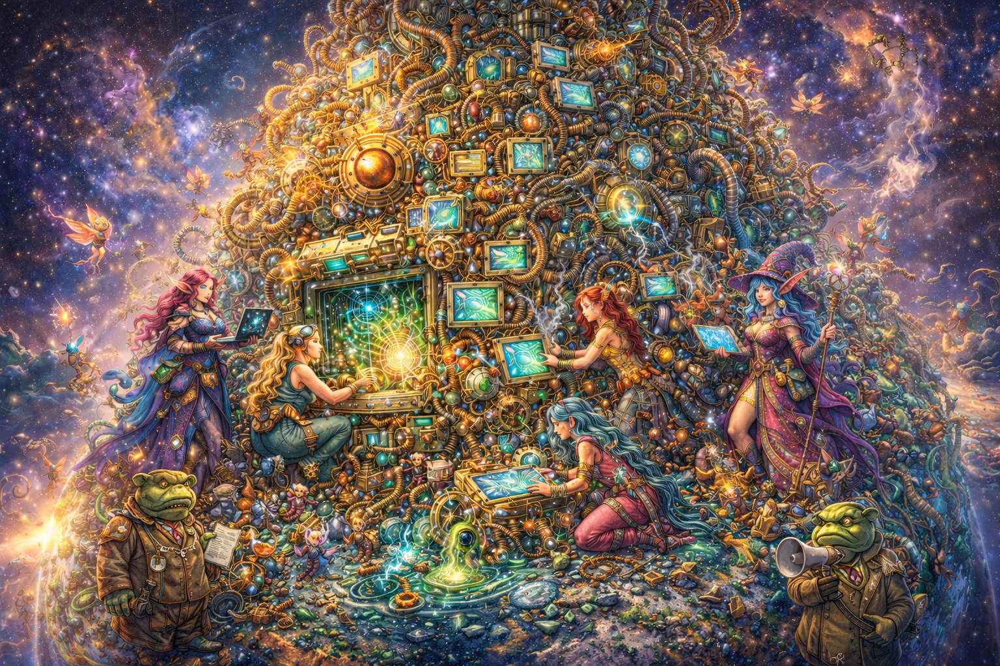

_Oh freddled gruntbuggly_,                                      
&nbsp;&nbsp;&nbsp;&nbsp;_Thy micturations are to me_                                      
_As plurdled gabbleblotchits on a lurgid bee_.                                      
&nbsp;&nbsp;&nbsp;&nbsp;_Groop, I implore thee, my foonting turlingdromes_,                                      
_And hooptiously drangle me with crinkly bindlewurdles_,                                      
&nbsp;&nbsp;&nbsp;&nbsp;_Or I will rend thee in the gobberwarts_                                      
_With my blurglecruncheon, see if I don't!_                                
&nbsp;&nbsp;&nbsp;&nbsp;&nbsp;&nbsp;&nbsp;&nbsp;&nbsp;&nbsp;&nbsp;&nbsp;- Prostetnic Vogon Jeltz, in **Douglas Adams' "The Hitchhiker's Guide to the Galaxy"**                          
                          
#### Columnar Layout                            
#### &nbsp;&nbsp;&nbsp;&nbsp;Array of Structs                            
#### Struct of Arrays                            
#### &nbsp;&nbsp;&nbsp;&nbsp;Metadata Medatata                            
#### Zero Copy                            
#### &nbsp;&nbsp;&nbsp;&nbsp;Distributed                            
#### Relational                             
#### &nbsp;&nbsp;&nbsp;&nbsp;Data Engineering                              
# **vogon-poetry**                          
                          
concepts like zero-copy-columnar-distributed-vectorized etc. that sound like Vogon Poetry to data engineering teams trying to modernize their game...                                         
                                       
                                                           
<html>                                                          
	                                                          
</html>                                   
                                       
                                    
# Refs:
* [Vogons](https://www.bbc.co.uk/cult/hitchhikers/guide/vogon.shtml) and [Vogon Poetry](https://en.wikipedia.org/wiki/Vogon#Poetry)
* [HHGTTG](https://en.wikipedia.org/wiki/The_Hitchhiker%27s_Guide_to_the_Galaxy)
* 
  
# Unrelated learning
* to indent things in markdown - add ```&nbsp;``` because markdown will shave off all whitespaces. 