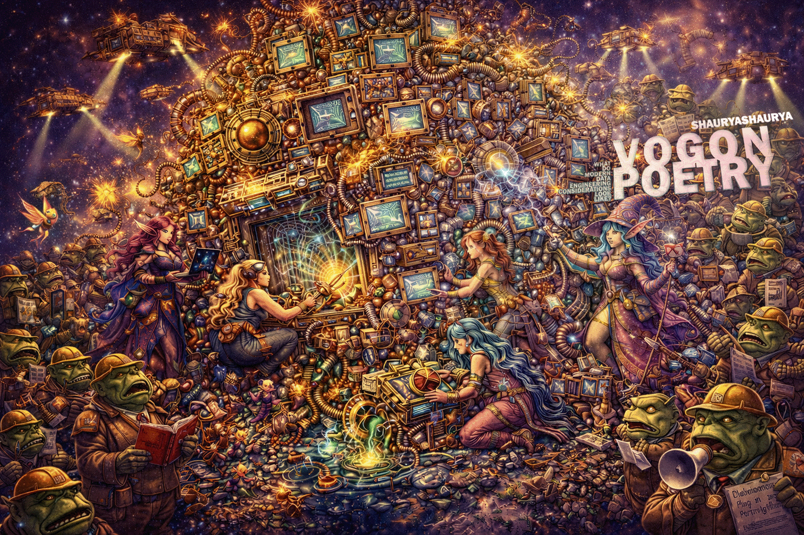

                                                                                     
<html>                                                                                    
	                                                                                    
</html>                                                             
                           
                          
_Oh freddled gruntbuggly_,                                                                
&nbsp;&nbsp;&nbsp;&nbsp;_Thy micturations are to me_                                                                
_As plurdled gabbleblotchits on a lurgid bee_.                                                                
&nbsp;&nbsp;&nbsp;&nbsp;_Groop, I implore thee, my foonting turlingdromes_,                                                                
_And hooptiously drangle me with crinkly bindlewurdles_,                                                                
&nbsp;&nbsp;&nbsp;&nbsp;_Or I will rend thee in the gobberwarts_                                                                
_With my blurglecruncheon, see if I don't!_                                                          
&nbsp;&nbsp;&nbsp;&nbsp;&nbsp;&nbsp;&nbsp;&nbsp;&nbsp;&nbsp;&nbsp;&nbsp;- Prostetnic Vogon Jeltz, in **Douglas Adams' "The Hitchhiker's Guide to the Galaxy"**                                                    
                                                    
...and on similar lines we have...                                
                   						                            
Columnar Layout                                                      
&nbsp;&nbsp;&nbsp;&nbsp;Array of Structs                                                      
Struct of Arrays                                                      
&nbsp;&nbsp;&nbsp;&nbsp;Metadata Medatata                                                      
Zero Copy                                                      
&nbsp;&nbsp;&nbsp;&nbsp;Distributed                                                      
Relational                                                       
&nbsp;&nbsp;&nbsp;&nbsp;Data Engineering                                                        
# **VOGON POETRY**                                                    
                                                    
concepts like zero-copy-columnar-layout-distributed-vectorized etc. that sound like Vogon Poetry to data engineering teams trying to modernize their game...                                                                   
                                                                 
# Recitals                          
* [Poem 01-001](https://github.com/shauryashaurya/vogon-poetry/blob/main/001-01.ipynb)                          
&nbsp;&nbsp;&nbsp;&nbsp;	*Zero copy? what zero copy? Buffers? I want to hit someone right now* by *Vogon Constant Mown*                                                                                                    
                                                                      
                                                                      
                                                                      
                                                                      
# Refs:      
* [Apache Arrow Specifications](https://arrow.apache.org/docs/format/index.html#format)
* [Apache Arrow on GitHub](https://github.com/apache/arrow)
* [Apache Arrow Python Cookbook](https://arrow.apache.org/cookbook/py/index.html)         
---       
           
* [Vogons](https://www.bbc.co.uk/cult/hitchhikers/guide/vogon.shtml) and [Vogon Poetry](https://en.wikipedia.org/wiki/Vogon#Poetry)                          
* [Notable Vogons](https://hitchhikers.fandom.com/wiki/Vogon)    
* [HHGTTG](https://en.wikipedia.org/wiki/The_Hitchhiker%27s_Guide_to_the_Galaxy)                          
                          
                            
                            
                            
                            
                            
# Unrelated learning                          
* to indent things in markdown - add ```&nbsp;``` because markdown will shave off all whitespaces. 