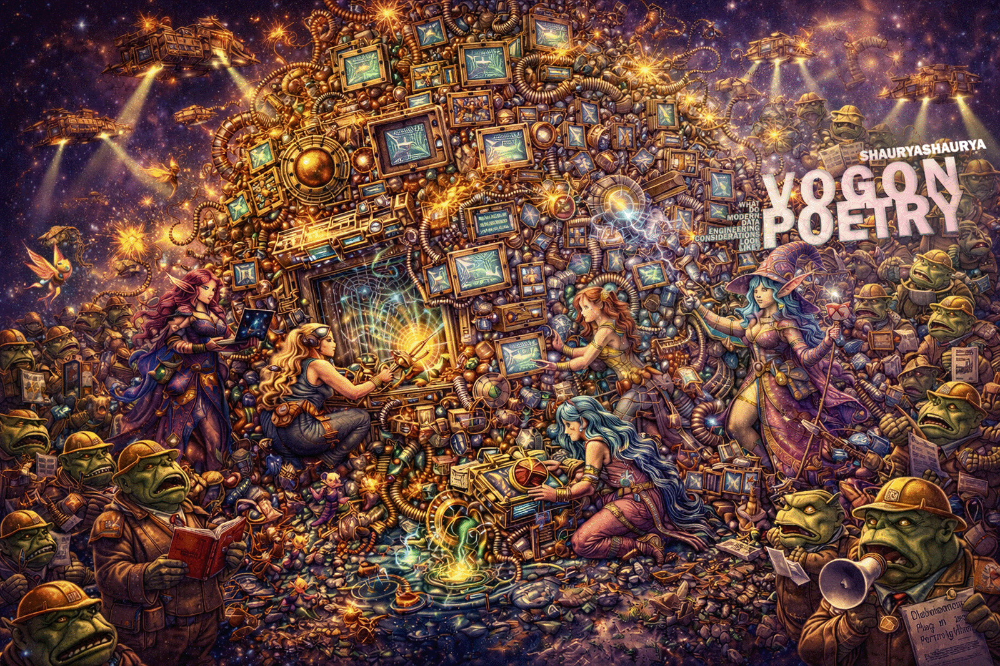

                                                                                                                                             
<html>                                                                                                                                            
	                                                                                                                                            
</html>                                                                                                                     
                                                                                   
                                                                                  
_Oh freddled gruntbuggly_,                                                                                                                        
&nbsp;&nbsp;&nbsp;&nbsp;_Thy micturations are to me_                                                                                                                        
_As plurdled gabbleblotchits on a lurgid bee_.                                                                                                                        
&nbsp;&nbsp;&nbsp;&nbsp;_Groop, I implore thee, my foonting turlingdromes_,                                                                                                                        
_And hooptiously drangle me with crinkly bindlewurdles_,                                                                                                                        
&nbsp;&nbsp;&nbsp;&nbsp;_Or I will rend thee in the gobberwarts_                                                                                                                        
_With my blurglecruncheon, see if I don't!_                                                                                                                  
&nbsp;&nbsp;&nbsp;&nbsp;&nbsp;&nbsp;&nbsp;&nbsp;&nbsp;&nbsp;&nbsp;&nbsp;- Prostetnic Vogon Jeltz, in **Douglas Adams' "The Hitchhiker's Guide to the Galaxy"**                                                                                                            
                                                                                                            
...and on similar lines we have...                                                                                        
                   						                                                                                    
Columnar Layout                                                                                                              
&nbsp;&nbsp;&nbsp;&nbsp;Array of Structs                                                                                                              
Struct of Arrays                                                                                                              
&nbsp;&nbsp;&nbsp;&nbsp;Metadata Medatata                                                                                                              
Zero Copy                                                                                                              
&nbsp;&nbsp;&nbsp;&nbsp;Distributed                                                                                                              
Relational                                                                                                               
&nbsp;&nbsp;&nbsp;&nbsp;Data Engineering                               
                        
                        
                        
                        
                        
                                                                                                         
# **VOGON POETRY**                                                                                                            
                                                                                                            
By order of Galactic Hyperspace Planning Council,                                           
Recitation shall now begin, without mercy.                                          
Resistance is useless.                                        
                                        
***Family A, Mechanical Sympathy***                                          
Physical form dominates performance                                          
Movement is the cost                                          
Batch beats tuple-at-a-time                                        
                                        
***Family B, Do Less And Prove It***                                          
Declare what; let the planner choose how                                          
The fastest work is skipped work                                          
Approximate on purpose                                        
                                        
***Family C, Distribution***                                          
Placement decides what is cheap                                        
                                        
***Family D, State, Time, And Safe Re-runs***                                          
Durability is an append-only log plus a snapshot                                          
Time and ordering are plural and uncertain                                          
Design every pipeline to be safe to re-run                                        
                                        
***Family E, Storage As A Substrate***                                          
A table is metadata over immutable files                                          
Compose interchangeable layers through open standards                                        
                                        
***Family F, Operating Under Load And Trust***                                          
A system that cannot say no will fail                                          
Data is a product with a contract                                        
                                        
***Family G, Policy And Economics***                                          
Enforce policy at the chokepoint                                          
Cost is an architecture decision                                        
                                        
***Family H, Data For AI***                                          
Meaning becomes geometry                                          
Feed the accelerator                                        
                                        
There.                                           
You may now applaud.                                        
                                        
                                                                                                                         
# SCIPY 2026! This paper was shortlisted for SciPy 2026                                                                                   
* [PAPER AND RELATED RESOURCES](https://github.com/shauryashaurya/vogon-poetry/tree/main/scipy2026)                                                              
                                                        
                                                        
                                                        
                                                        
# [Interactive Concept Viewer](https://shauryashaurya.github.io/vogon-poetry/vogon-poetry-concept-viewer/)                                                
                                                
Open [this link](https://shauryashaurya.github.io/vogon-poetry/vogon-poetry-concept-viewer/) to interact with all the poetry.                                                        
                                                                            
                                                                                                                                                            
                                                                                                                              
                                                                                                                              
                                                                                                                              
                                                                                                                              
# Refs:                                                              
* [Apache Arrow Specifications](https://arrow.apache.org/docs/format/index.html#format)                                                        
* [Apache Arrow on GitHub](https://github.com/apache/arrow)                                                        
* [Apache Arrow Python Cookbook](https://arrow.apache.org/cookbook/py/index.html)                                                                 
---                                                               
                                                                   
* [Vogons](https://www.bbc.co.uk/cult/hitchhikers/guide/vogon.shtml) and [Vogon Poetry](https://en.wikipedia.org/wiki/Vogon#Poetry)                                                                                  
* [Notable Vogons](https://hitchhikers.fandom.com/wiki/Vogon)                                                            
* [HHGTTG](https://en.wikipedia.org/wiki/The_Hitchhiker%27s_Guide_to_the_Galaxy)                                                                                  
                                                                                  
                                                                                    
                                                                                    
                                                                                    
                                                                                    
                                                                                    
# Unrelated learning                                                                                  
* to indent things in markdown - add ```&nbsp;``` because markdown will shave off all whitespaces.                                                    
&nbsp;&nbsp;&nbsp;&nbsp;	*Zero copy? what zero copy? Buffers? I want to hit someone right now* by *Vogon Constant Mown*